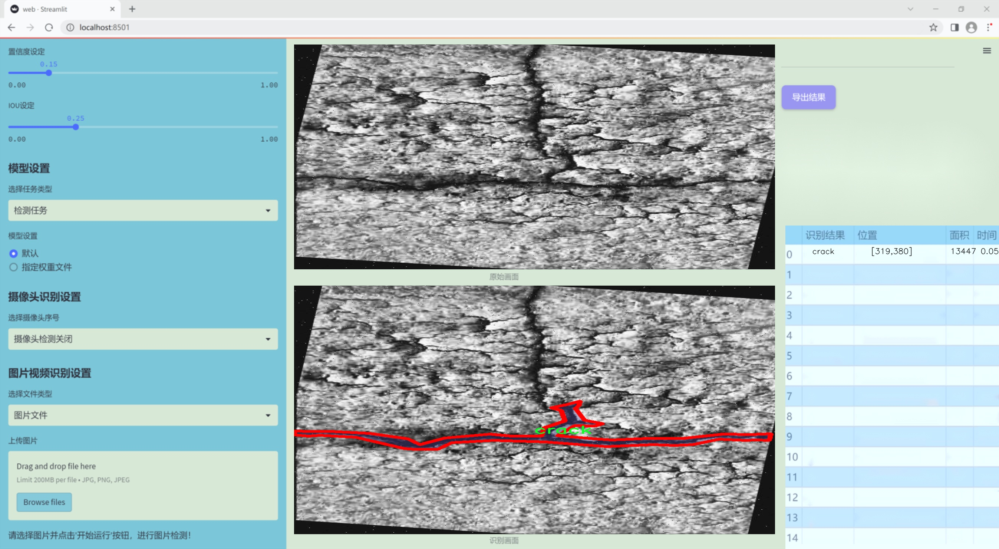
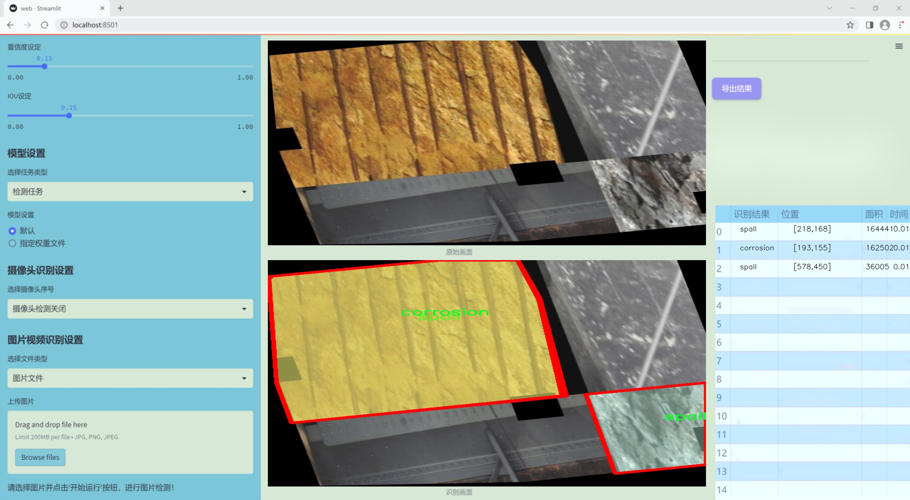
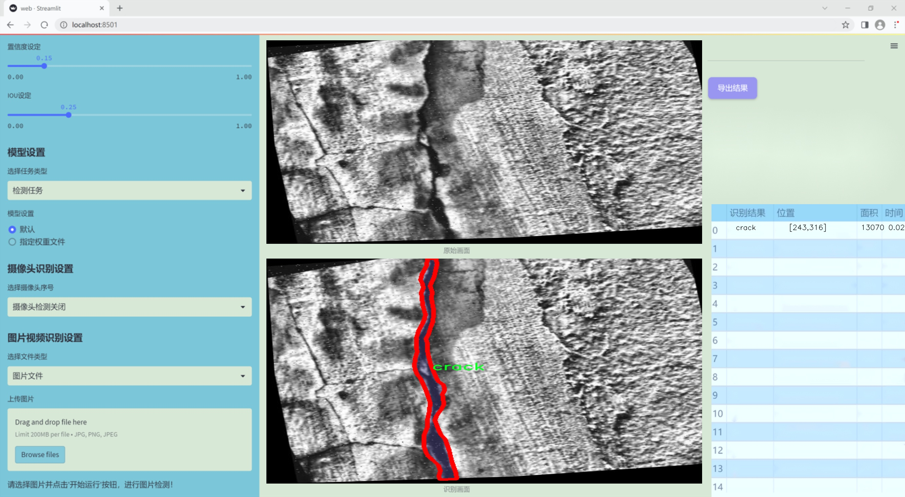
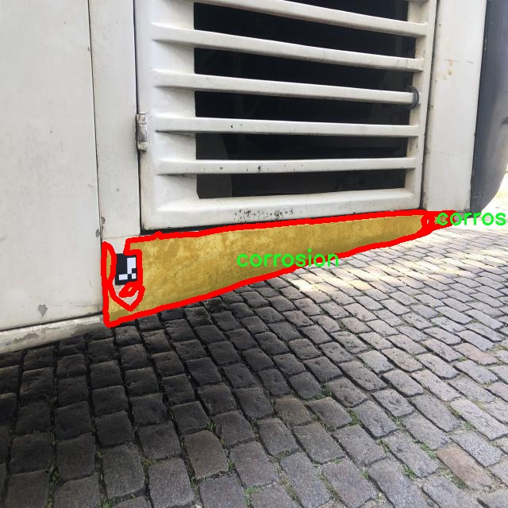
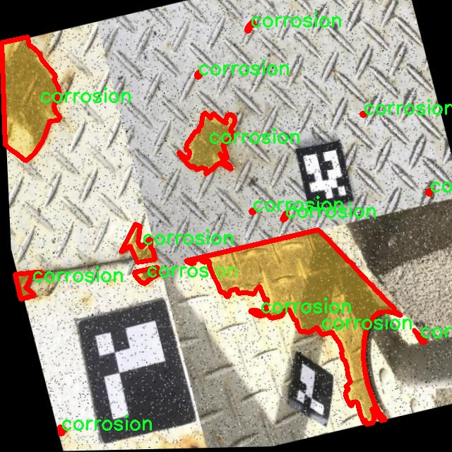
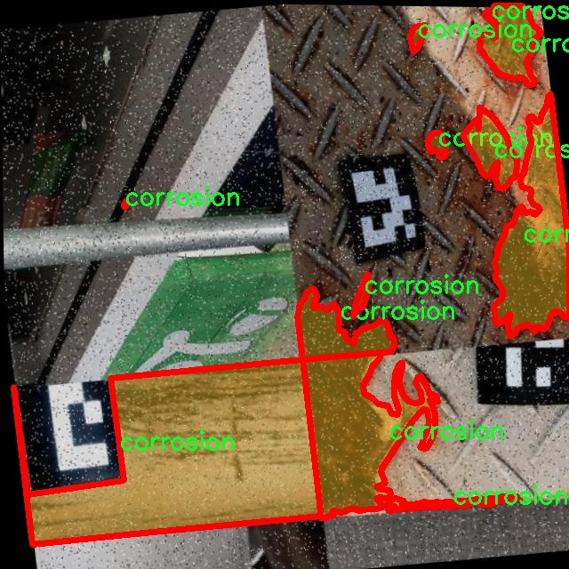
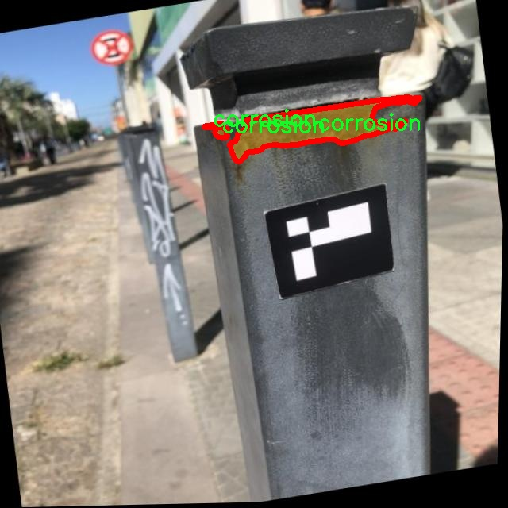
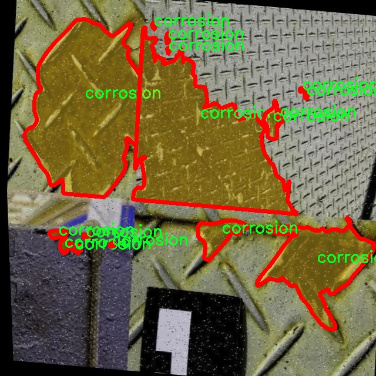

### 1.背景意义

研究背景与意义

随着城市化进程的加快，建筑结构的安全性和耐久性日益受到关注。建筑物在使用过程中，由于环境因素、材料老化及人为因素等，可能会出现各种损伤，如腐蚀、裂缝和剥落等。这些损伤不仅影响建筑物的美观，更可能对其结构安全造成严重威胁。因此，及时、准确地检测和评估建筑结构的损伤状况，对于保障公共安全、延长建筑物的使用寿命具有重要意义。

传统的建筑结构损伤检测方法多依赖人工检查，这种方法不仅耗时耗力，而且容易受到主观因素的影响，导致漏检或误判。近年来，随着计算机视觉技术的迅猛发展，基于深度学习的自动化检测方法逐渐成为研究热点。YOLO（You Only Look Once）系列模型因其高效的实时检测能力，广泛应用于目标检测领域。特别是YOLOv11的出现，进一步提升了检测精度和速度，为建筑结构损伤检测提供了新的技术手段。

本研究旨在基于改进的YOLOv11模型，构建一个高效的建筑结构损伤检测系统。我们将利用一个包含1800张图像的损伤数据集，该数据集涵盖了腐蚀、裂缝和剥落三种主要损伤类型。通过对数据集的深入分析和模型的优化，我们期望能够提高损伤检测的准确性和效率。此外，借助实例分割技术，我们将实现对损伤区域的精确定位，为后续的结构评估和修复提供数据支持。

综上所述，本研究不仅具有重要的理论意义，也为实际工程应用提供了可行的解决方案，推动了建筑结构健康监测技术的发展。通过实现智能化的损伤检测系统，我们希望能够为建筑行业的安全管理提供更为可靠的技术保障。

### 2.视频效果

[2.1 视频效果](https://www.bilibili.com/video/BV1tQqqYWEDH/)

### 3.图片效果







##### [项目涉及的源码数据来源链接](https://kdocs.cn/l/cszuIiCKVNis)**

注意：本项目提供训练的数据集和训练教程,由于版本持续更新,暂不提供权重文件（best.pt）,请按照6.训练教程进行训练后实现上图演示的效果。

### 4.数据集信息

##### 4.1 本项目数据集类别数＆类别名

nc: 3
names: ['corrosion', 'crack', 'spall']


该项目为【图像分割】数据集，请在【训练教程和Web端加载模型教程（第三步）】这一步的时候按照【图像分割】部分的教程来训练

##### 4.2 本项目数据集信息介绍

本项目数据集信息介绍

本项目所使用的数据集专注于建筑结构损伤的检测，旨在改进YOLOv11模型的性能，以实现更高效、准确的损伤识别。数据集的主题围绕“Damages”，涵盖了建筑物在使用过程中可能出现的三种主要损伤类型，分别为腐蚀（corrosion）、裂缝（crack）和剥落（spall）。这些损伤不仅影响建筑物的美观，更重要的是直接关系到其安全性和使用寿命，因此，及时、准确地检测和评估这些损伤至关重要。

在数据集的构建过程中，我们收集了大量的高质量图像，这些图像来自于不同类型的建筑结构，包括住宅、商业建筑及基础设施等。每一类损伤都经过精心标注，以确保模型在训练过程中能够学习到不同损伤特征的细微差别。腐蚀损伤通常表现为金属表面的锈蚀或混凝土的剥落，裂缝则可能出现在墙体、地面或其他结构部位，剥落则是指建筑材料的表层脱落，这些损伤类型在实际应用中常常相互交织，给检测带来了挑战。

数据集中包含的图像数量和多样性使得模型能够在各种环境和条件下进行训练，从而提高其泛化能力。通过对这些损伤类型的深入学习，改进后的YOLOv11模型将能够更快速、更准确地识别建筑结构中的潜在问题，进而为后续的维护和修复提供科学依据。总之，本项目的数据集不仅为建筑结构损伤检测提供了坚实的基础，也为未来的研究和应用开辟了新的方向。











### 5.全套项目环境部署视频教程（零基础手把手教学）

[5.1 所需软件PyCharm和Anaconda安装教程（第一步）](https://www.bilibili.com/video/BV1BoC1YCEKi/?spm_id_from=333.999.0.0&vd_source=bc9aec86d164b67a7004b996143742dc)


[5.2 安装Python虚拟环境创建和依赖库安装视频教程（第二步）](https://www.bilibili.com/video/BV1ZoC1YCEBw?spm_id_from=333.788.videopod.sections&vd_source=bc9aec86d164b67a7004b996143742dc)

### 6.改进YOLOv11训练教程和Web_UI前端加载模型教程（零基础手把手教学）

[6.1 改进YOLOv11训练教程和Web_UI前端加载模型教程（第三步）](https://www.bilibili.com/video/BV1BoC1YCEhR?spm_id_from=333.788.videopod.sections&vd_source=bc9aec86d164b67a7004b996143742dc)


按照上面的训练视频教程链接加载项目提供的数据集，运行train.py即可开始训练



     Epoch   gpu_mem       box       obj       cls    labels  img_size
     1/200     20.8G   0.01576   0.01955  0.007536        22      1280: 100%|██████████| 849/849 [14:42<00:00,  1.04s/it]
               Class     Images     Labels          P          R     mAP@.5 mAP@.5:.95: 100%|██████████| 213/213 [01:14<00:00,  2.87it/s]
                 all       3395      17314      0.994      0.957      0.0957      0.0843

     Epoch   gpu_mem       box       obj       cls    labels  img_size
     2/200     20.8G   0.01578   0.01923  0.007006        22      1280: 100%|██████████| 849/849 [14:44<00:00,  1.04s/it]
               Class     Images     Labels          P          R     mAP@.5 mAP@.5:.95: 100%|██████████| 213/213 [01:12<00:00,  2.95it/s]
                 all       3395      17314      0.996      0.956      0.0957      0.0845

     Epoch   gpu_mem       box       obj       cls    labels  img_size
     3/200     20.8G   0.01561    0.0191  0.006895        27      1280: 100%|██████████| 849/849 [10:56<00:00,  1.29it/s]
               Class     Images     Labels          P          R     mAP@.5 mAP@.5:.95: 100%|███████   | 187/213 [00:52<00:00,  4.04it/s]
                 all       3395      17314      0.996      0.957      0.0957      0.0845


###### [项目数据集下载链接](https://kdocs.cn/l/cszuIiCKVNis)

### 7.原始YOLOv11算法讲解


YOLO11 是 Ultralytics YOLO 系列的最新版本，结合了尖端的准确性、速度和效率，用于目标检测、分割、分类、定向边界框和姿态估计。与
YOLOv8 相比，它具有更少的参数和更好的结果，不难预见，YOLO11 在边缘设备上更高效、更快，将频繁出现在计算机视觉领域的最先进技术（SOTA）中。


**主要特点**

  * **增强的特征提取：**YOLO11 使用改进的主干和颈部架构来增强特征提取，以实现更精确的目标检测和复杂任务的性能。

  * **针对效率和速度优化：**精细的架构设计和优化的训练流程在保持准确性和性能之间最佳平衡的同时，提供更快的处理速度。

  * **更少的参数，更高的准确度：**YOLO11m 在 COCO 数据集上实现了比 YOLOv8m 更高的 mAP，参数减少了 22%，提高了计算效率，同时不牺牲准确度。

  * **跨环境的适应性：**YOLO11 可以无缝部署在边缘设备、云平台和配备 NVIDIA GPU 的系统上，确保最大的灵活性。

  * **支持广泛的任务范围：**YOLO11 支持各种计算机视觉任务，如目标检测、实例分割、图像分类、姿态估计和定向目标检测（OBB）。


### 8.200+种全套改进YOLOV11创新点原理讲解

#### 8.1 200+种全套改进YOLOV11创新点原理讲解大全

由于篇幅限制，每个创新点的具体原理讲解就不全部展开，具体见下列网址中的改进模块对应项目的技术原理博客网址【Blog】（创新点均为模块化搭建，原理适配YOLOv5~YOLOv11等各种版本）

[改进模块技术原理博客【Blog】网址链接](https://gitee.com/qunmasj/good)


#### 8.2 精选部分改进YOLOV11创新点原理讲解

###### 这里节选部分改进创新点展开原理讲解(完整的改进原理见上图和[改进模块技术原理博客链接](https://gitee.com/qunmasj/good)【如果此小节的图加载失败可以通过CSDN或者Github搜索该博客的标题访问原始博客，原始博客图片显示正常】


### 空间和通道重建卷积SCConv
参考该博客提出的一种高效的卷积模块，称为SCConv (spatial and channel reconstruction convolution)，以减少冗余计算并促进代表性特征的学习。提出的SCConv由空间重构单元(SRU)和信道重构单元(CRU)两个单元组成。

（1）SRU根据权重分离冗余特征并进行重构，以抑制空间维度上的冗余，增强特征的表征。

（2）CRU采用分裂变换和融合策略来减少信道维度的冗余以及计算成本和存储。

（3）SCConv是一种即插即用的架构单元，可直接用于替代各种卷积神经网络中的标准卷积。实验结果表明，scconvo嵌入模型能够通过减少冗余特征来获得更好的性能，并且显著降低了复杂度和计算成本。


SCConv如图所示，它由两个单元组成，空间重建单元(SRU)和通道重建单元(CRU)，以顺序的方式放置。具体而言，对于瓶颈残差块中的中间输入特征X，首先通过SRU运算获得空间细化特征Xw，然后利用CRU运算获得信道细化特征Y。SCConv模块充分利用了特征之间的空间冗余和通道冗余，可以无缝集成到任何CNN架构中，以减少中间特征映射之间的冗余并增强CNN的特征表示。

#### SRU单元用于空间冗余


为了利用特征的空间冗余，引入了空间重构单元(SRU)，如图2所示，它利用了分离和重构操作。

分离操作 的目的是将信息丰富的特征图与空间内容对应的信息较少的特征图分离开来。我们利用组归一化(GN)层中的比例因子来评估不同特征图的信息内容。具体来说，给定一个中间特征映射X∈R N×C×H×W，首先通过减去平均值µ并除以标准差σ来标准化输入特征X，如下所示:


其中µ和σ是X的均值和标准差，ε是为了除法稳定性而加入的一个小的正常数，γ和β是可训练的仿射变换。

GN层中的可训练参数\gamma \in R^{C}用于测量每个批次和通道的空间像素方差。更丰富的空间信息反映了空间像素的更多变化，从而导致更大的γ。归一化相关权重W_{\gamma} \in R^{C}由下面公式2得到，表示不同特征映射的重要性。


然后将经Wγ重新加权的特征映射的权值通过sigmoid函数映射到(0,1)范围，并通过阈值进行门控。我们将阈值以上的权重设置为1，得到信息权重W1，将其设置为0，得到非信息权重W2(实验中阈值设置为0.5)。获取W的整个过程可以用公式表示。


最后将输入特征X分别乘以W1和W2，得到两个加权特征:信息量较大的特征X_{1}^{\omega }和信息量较小的特征X_{2}^{\omega }。这样就成功地将输入特征分为两部分:X_{1}^{\omega }具有信息量和表达性的空间内容，而X_{2}^{\omega }几乎没有信息，被认为是冗余的。

重构操作 将信息丰富的特征与信息较少的特征相加，生成信息更丰富的特征，从而节省空间空间。采用交叉重构运算，将加权后的两个不同的信息特征充分结合起来，加强它们之间的信息流。然后将交叉重构的特征X^{\omega1}和X^{\omega2}进行拼接，得到空间精细特征映射X^{\omega}。从后过程表示如下：


其中⊗是逐元素的乘法，⊕是逐元素的求和，∪是串联。将SRU应用于中间输入特征X后，不仅将信息特征与信息较少的特征分离，而且对其进行重构，增强代表性特征，抑制空间维度上的冗余特征。然而，空间精细特征映射X^{\omega}在通道维度上仍然是冗余的。

#### CRU单元用于通道冗余


分割 操作将输入的空间细化特征X^{\omega}分割成两个部分，一部分通道数是\alpha C，另一部分通道数是(1-\alpha) C，随后对两组特征的通道数使用1 * 1卷积核进行压缩，分别得到X_{up}和X_{low}。

转换 操作将输入的X_{up}作为“富特征提取”的输入，分别进行GWC和PWC，然后相加得到输出Y1，将输入X_{low}作为“富特征提取”的补充，进行PWC，得到的记过和原来的输入取并集得到Y2。

融合 操作使用简化的SKNet方法来自适应合并Y1和Y2。具体说是首先使用全局平均池化将全局空间信息和通道统计信息结合起来，得到经过池化的S1和S2。然后对S1和S2做Softmax得到特征权重向量\beta _{1}和\beta _{2}，最后使用特征权重向量得到输出Y = \beta _{1}*Y_{1} + \beta _{2}*Y_{2}，Y即为通道提炼的特征。


### 9.系统功能展示

图9.1.系统支持检测结果表格显示

  图9.2.系统支持置信度和IOU阈值手动调节

  图9.3.系统支持自定义加载权重文件best.pt(需要你通过步骤5中训练获得)

  图9.4.系统支持摄像头实时识别

  图9.5.系统支持图片识别

  图9.6.系统支持视频识别

  图9.7.系统支持识别结果文件自动保存

  图9.8.系统支持Excel导出检测结果数据


### 10. YOLOv11核心改进源码讲解

#### 10.1 val.py

以下是对给定代码的核心部分进行提炼和详细注释的结果：

```python
import os
import torch
from ultralytics.data import build_dataloader, build_yolo_dataset, converter
from ultralytics.engine.validator import BaseValidator
from ultralytics.utils import LOGGER, ops
from ultralytics.utils.metrics import ConfusionMatrix, DetMetrics, box_iou

class DetectionValidator(BaseValidator):
    """
    扩展自 BaseValidator 类的检测模型验证器。
    用于评估 YOLO 模型的性能。
    """

    def __init__(self, dataloader=None, save_dir=None, pbar=None, args=None, _callbacks=None):
        """初始化检测模型，设置必要的变量和参数。"""
        super().__init__(dataloader, save_dir, pbar, args, _callbacks)
        self.metrics = DetMetrics(save_dir=self.save_dir, on_plot=self.on_plot)  # 初始化检测指标
        self.iouv = torch.linspace(0.5, 0.95, 10)  # IoU 向量，用于计算 mAP@0.5:0.95

    def preprocess(self, batch):
        """对输入图像批次进行预处理，以适应 YOLO 模型的输入格式。"""
        batch["img"] = batch["img"].to(self.device, non_blocking=True)  # 将图像移动到指定设备
        batch["img"] = (batch["img"].half() if self.args.half else batch["img"].float()) / 255  # 归一化图像
        for k in ["batch_idx", "cls", "bboxes"]:
            batch[k] = batch[k].to(self.device)  # 将其他数据移动到设备

        return batch

    def postprocess(self, preds):
        """对模型预测结果应用非极大值抑制（NMS），以去除冗余的检测框。"""
        return ops.non_max_suppression(
            preds,
            self.args.conf,
            self.args.iou,
            multi_label=True,
            agnostic=self.args.single_cls,
            max_det=self.args.max_det,
        )

    def update_metrics(self, preds, batch):
        """更新检测指标，包括 TP、FP 等统计信息。"""
        for si, pred in enumerate(preds):
            npr = len(pred)  # 当前图像的预测数量
            pbatch = self._prepare_batch(si, batch)  # 准备当前图像的真实标签
            cls, bbox = pbatch.pop("cls"), pbatch.pop("bbox")  # 获取真实类别和边界框

            if npr == 0:  # 如果没有预测
                continue

            predn = self._prepare_pred(pred, pbatch)  # 准备预测结果
            stat = {
                "conf": predn[:, 4],  # 置信度
                "pred_cls": predn[:, 5],  # 预测类别
                "tp": self._process_batch(predn, bbox, cls)  # 计算 TP
            }
            # 更新统计信息
            for k in self.stats.keys():
                self.stats[k].append(stat[k])

    def get_stats(self):
        """返回检测指标的统计信息。"""
        stats = {k: torch.cat(v, 0).cpu().numpy() for k, v in self.stats.items()}  # 转换为 numpy 数组
        if len(stats) and stats["tp"].any():
            self.metrics.process(**stats)  # 处理指标
        return self.metrics.results_dict  # 返回结果字典

    def print_results(self):
        """打印每个类别的训练/验证集指标。"""
        pf = "%22s" + "%11i" * 2 + "%11.3g" * len(self.metrics.keys)  # 打印格式
        LOGGER.info(pf % ("all", self.seen, self.nt_per_class.sum(), *self.metrics.mean_results()))  # 打印总结果

    def _process_batch(self, detections, gt_bboxes, gt_cls):
        """
        返回正确的预测矩阵。

        参数:
            detections (torch.Tensor): 预测结果的张量，形状为 [N, 6]。
            gt_bboxes (torch.Tensor): 真实边界框的张量，形状为 [M, 5]。

        返回:
            (torch.Tensor): 正确的预测矩阵，形状为 [N, 10]，对应 10 个 IoU 水平。
        """
        iou = box_iou(gt_bboxes, detections[:, :4])  # 计算 IoU
        return self.match_predictions(detections[:, 5], gt_cls, iou)  # 匹配预测与真实标签

    def build_dataset(self, img_path, mode="val", batch=None):
        """
        构建 YOLO 数据集。

        参数:
            img_path (str): 图像文件夹路径。
            mode (str): 模式（训练或验证）。
            batch (int, optional): 批次大小。

        返回:
            数据集对象。
        """
        return build_yolo_dataset(self.args, img_path, batch, self.data, mode=mode)

    def get_dataloader(self, dataset_path, batch_size):
        """构建并返回数据加载器。"""
        dataset = self.build_dataset(dataset_path, batch=batch_size, mode="val")  # 构建数据集
        return build_dataloader(dataset, batch_size, self.args.workers, shuffle=False)  # 返回数据加载器
```

### 代码核心部分说明：
1. **DetectionValidator 类**：这是主要的验证器类，负责评估 YOLO 模型的性能。
2. **初始化方法**：设置必要的参数和指标。
3. **预处理方法**：将输入图像进行归一化和设备转换。
4. **后处理方法**：应用非极大值抑制以去除冗余检测框。
5. **更新指标方法**：更新检测指标，包括 TP、FP 等。
6. **获取统计信息方法**：返回检测指标的统计信息。
7. **打印结果方法**：打印每个类别的训练/验证集指标。
8. **构建数据集和数据加载器方法**：用于构建 YOLO 数据集和返回数据加载器。

这些核心部分是实现 YOLO 模型验证的基础，确保模型能够正确评估其性能。

这个文件 `val.py` 是一个用于目标检测模型验证的程序，主要基于 Ultralytics YOLO（You Only Look Once）框架。程序中定义了一个 `DetectionValidator` 类，继承自 `BaseValidator`，用于处理模型验证的各个步骤。

在初始化方法中，`DetectionValidator` 设置了一些基本参数，如数据加载器、保存目录、进度条、参数和回调函数等。它还定义了一些用于计算检测性能的指标，包括每个类别的目标数量、是否使用 COCO 数据集、类别映射、检测指标等。`iou`（Intersection over Union）向量用于计算不同阈值下的平均精度（mAP）。

`preprocess` 方法用于对输入的图像批次进行预处理，包括将图像数据转移到指定设备（如 GPU），并进行归一化处理。该方法还会根据需要保存用于自动标注的边界框信息。

`init_metrics` 方法初始化模型评估指标，确定数据集是否为 COCO 格式，并设置相关的类别映射和混淆矩阵。

`get_desc` 方法返回一个格式化的字符串，用于总结每个类别的指标。

`postprocess` 方法应用非极大值抑制（NMS）来处理模型的预测输出，以去除重复的检测框。

`_prepare_batch` 和 `_prepare_pred` 方法分别用于准备验证批次的真实标签和模型预测，确保它们的格式和尺寸一致。

`update_metrics` 方法用于更新检测指标，包括计算真正例、预测类别等，并将结果保存到指定格式的文件中。

`finalize_metrics` 方法设置最终的指标值，包括计算速度和混淆矩阵。

`get_stats` 方法返回计算的指标统计信息，并更新每个类别的目标数量。

`print_results` 方法打印训练或验证集的每个类别的指标，并在需要时绘制混淆矩阵。

`_process_batch` 方法计算正确预测的矩阵，返回符合 IoU 阈值的预测结果。

`build_dataset` 和 `get_dataloader` 方法用于构建 YOLO 数据集和返回数据加载器，以便于后续的验证过程。

`plot_val_samples` 和 `plot_predictions` 方法用于绘制验证样本和模型预测的边界框，并将结果保存为图像文件。

`save_one_txt` 方法将 YOLO 检测结果保存为文本文件，采用规范化的坐标格式。

`pred_to_json` 方法将模型预测结果序列化为 COCO JSON 格式，以便于后续评估。

`eval_json` 方法用于评估以 JSON 格式保存的 YOLO 输出，并返回性能统计信息，特别是计算 mAP（平均精度）。

整个程序的设计旨在高效地处理目标检测模型的验证过程，提供了多种功能来评估模型性能，并支持与 COCO 数据集的兼容性。

#### 10.2 kacn_conv.py

以下是代码中最核心的部分，并附上详细的中文注释：

```python
import torch
import torch.nn as nn

class KACNConvNDLayer(nn.Module):
    def __init__(self, conv_class, norm_class, input_dim, output_dim, degree, kernel_size,
                 groups=1, padding=0, stride=1, dilation=1,
                 ndim: int = 2, dropout=0.0):
        super(KACNConvNDLayer, self).__init__()
        
        # 初始化输入和输出维度、卷积参数等
        self.inputdim = input_dim
        self.outdim = output_dim
        self.degree = degree
        self.kernel_size = kernel_size
        self.padding = padding
        self.stride = stride
        self.dilation = dilation
        self.groups = groups
        self.ndim = ndim
        
        # 初始化dropout层
        self.dropout = None
        if dropout > 0:
            if ndim == 1:
                self.dropout = nn.Dropout1d(p=dropout)
            elif ndim == 2:
                self.dropout = nn.Dropout2d(p=dropout)
            elif ndim == 3:
                self.dropout = nn.Dropout3d(p=dropout)

        # 检查groups参数的有效性
        if groups <= 0:
            raise ValueError('groups must be a positive integer')
        if input_dim % groups != 0:
            raise ValueError('input_dim must be divisible by groups')
        if output_dim % groups != 0:
            raise ValueError('output_dim must be divisible by groups')

        # 为每个组创建归一化层
        self.layer_norm = nn.ModuleList([norm_class(output_dim // groups) for _ in range(groups)])

        # 创建多项式卷积层
        self.poly_conv = nn.ModuleList([conv_class((degree + 1) * input_dim // groups,
                                                   output_dim // groups,
                                                   kernel_size,
                                                   stride,
                                                   padding,
                                                   dilation,
                                                   groups=1,
                                                   bias=False) for _ in range(groups)])
        
        # 注册一个缓冲区，用于存储多项式的系数
        arange_buffer_size = (1, 1, -1,) + tuple(1 for _ in range(ndim))
        self.register_buffer("arange", torch.arange(0, degree + 1, 1).view(*arange_buffer_size))
        
        # 使用Kaiming均匀分布初始化卷积层的权重
        for conv_layer in self.poly_conv:
            nn.init.normal_(conv_layer.weight, mean=0.0, std=1 / (input_dim * (degree + 1) * kernel_size ** ndim))

    def forward_kacn(self, x, group_index):
        # 对输入进行激活和线性变换
        x = torch.tanh(x)  # 应用tanh激活函数
        x = x.acos().unsqueeze(2)  # 计算反余弦并增加一个维度
        x = (x * self.arange).flatten(1, 2)  # 乘以多项式系数并展平
        x = x.cos()  # 计算余弦
        x = self.poly_conv[group_index](x)  # 通过对应的卷积层
        x = self.layer_norm[group_index](x)  # 归一化
        if self.dropout is not None:
            x = self.dropout(x)  # 应用dropout
        return x

    def forward(self, x):
        # 将输入按组分割
        split_x = torch.split(x, self.inputdim // self.groups, dim=1)
        output = []
        for group_ind, _x in enumerate(split_x):
            y = self.forward_kacn(_x.clone(), group_ind)  # 对每个组应用forward_kacn
            output.append(y.clone())
        y = torch.cat(output, dim=1)  # 将输出拼接
        return y
```

### 代码核心部分说明：
1. **KACNConvNDLayer类**：这是一个自定义的神经网络层，支持多维卷积操作。它可以根据输入的维度（1D、2D或3D）和其他参数（如卷积核大小、分组数等）进行初始化。

2. **初始化方法**：在初始化方法中，设置了输入输出维度、卷积参数、dropout层、归一化层和多项式卷积层，并进行了必要的参数检查。

3. **forward_kacn方法**：这是核心的前向传播方法，处理输入数据，应用激活函数、卷积操作和归一化。

4. **forward方法**：负责将输入数据按组分割，调用`forward_kacn`方法处理每个组，并将结果拼接成最终输出。

这个结构允许灵活地处理不同维度的卷积操作，并且通过多项式卷积和归一化来增强模型的表达能力。

这个程序文件定义了一个名为 `kacn_conv.py` 的模块，主要用于实现一种新的卷积层，称为 KACN（KACN Convolutional Layer）。该模块利用 PyTorch 框架构建了多个类，支持不同维度的卷积操作，包括一维、二维和三维卷积。

首先，`KACNConvNDLayer` 是一个基础类，继承自 `nn.Module`。在初始化方法中，接受多个参数，包括卷积类型、归一化类型、输入和输出维度、卷积核大小、分组数、填充、步幅、扩张率、维度数量以及 dropout 概率。该类确保输入和输出维度能够被分组数整除，并且提供了对 dropout 的支持。

在该类中，使用 `ModuleList` 创建了多个卷积层和归一化层，分别对应于输入的分组数。卷积层的权重使用 Kaiming 正态分布初始化，以帮助模型更好地训练。`forward_kacn` 方法实现了 KACN 的前向传播过程，首先对输入进行激活，然后通过多项式卷积层进行线性变换，最后应用归一化和 dropout（如果有的话）。

`forward` 方法则处理输入数据，将其按照分组进行拆分，然后对每个分组调用 `forward_kacn` 方法进行处理，最后将所有分组的输出拼接在一起。

接下来，`KACNConv3DLayer`、`KACNConv2DLayer` 和 `KACNConv1DLayer` 是针对三维、二维和一维卷积的具体实现类，它们分别调用 `KACNConvNDLayer` 的构造函数，传入相应的卷积和归一化类型。这些类的存在使得用户可以方便地创建不同维度的 KACN 卷积层。

总的来说，这个模块提供了一种灵活的方式来构建 KACN 卷积层，支持多种维度的卷积操作，并且具备了归一化和 dropout 的功能，以增强模型的表达能力和训练效果。

#### 10.3 mobilenetv4.py

以下是保留的核心代码部分，并添加了详细的中文注释：

```python
import torch
import torch.nn as nn

# 定义 MobileNetV4 的不同模型规格
MODEL_SPECS = {
    "MobileNetV4ConvSmall": MNV4ConvSmall_BLOCK_SPECS,
    "MobileNetV4ConvMedium": MNV4ConvMedium_BLOCK_SPECS,
    "MobileNetV4ConvLarge": MNV4ConvLarge_BLOCK_SPECS,
    "MobileNetV4HybridMedium": MNV4HybridConvMedium_BLOCK_SPECS,
    "MobileNetV4HybridLarge": MNV4HybridConvLarge_BLOCK_SPECS,
}

def conv_2d(inp, oup, kernel_size=3, stride=1, groups=1, bias=False, norm=True, act=True):
    """
    创建一个2D卷积层，包含卷积、批归一化和激活函数（ReLU6）。
    
    Args:
        inp: 输入通道数
        oup: 输出通道数
        kernel_size: 卷积核大小
        stride: 步幅
        groups: 分组卷积的组数
        bias: 是否使用偏置
        norm: 是否使用批归一化
        act: 是否使用激活函数

    Returns:
        nn.Sequential: 包含卷积层、批归一化和激活函数的序列
    """
    conv = nn.Sequential()
    padding = (kernel_size - 1) // 2  # 计算填充
    conv.add_module('conv', nn.Conv2d(inp, oup, kernel_size, stride, padding, bias=bias, groups=groups))
    if norm:
        conv.add_module('BatchNorm2d', nn.BatchNorm2d(oup))  # 添加批归一化
    if act:
        conv.add_module('Activation', nn.ReLU6())  # 添加激活函数
    return conv

class InvertedResidual(nn.Module):
    """
    反向残差块，用于 MobileNetV4 的构建。
    """
    def __init__(self, inp, oup, stride, expand_ratio, act=False):
        super(InvertedResidual, self).__init__()
        self.stride = stride
        assert stride in [1, 2]  # 步幅只能是1或2
        hidden_dim = int(round(inp * expand_ratio))  # 计算隐藏层维度
        self.block = nn.Sequential()
        if expand_ratio != 1:
            self.block.add_module('exp_1x1', conv_2d(inp, hidden_dim, kernel_size=1, stride=1))  # 扩展卷积
        self.block.add_module('conv_3x3', conv_2d(hidden_dim, hidden_dim, kernel_size=3, stride=stride, groups=hidden_dim))  # 深度卷积
        self.block.add_module('red_1x1', conv_2d(hidden_dim, oup, kernel_size=1, stride=1, act=act))  # 投影卷积
        self.use_res_connect = self.stride == 1 and inp == oup  # 判断是否使用残差连接

    def forward(self, x):
        if self.use_res_connect:
            return x + self.block(x)  # 使用残差连接
        else:
            return self.block(x)

class MobileNetV4(nn.Module):
    """
    MobileNetV4 模型的主类。
    """
    def __init__(self, model):
        super().__init__()
        assert model in MODEL_SPECS.keys()  # 确保模型在支持的规格中
        self.model = model
        self.spec = MODEL_SPECS[self.model]
       
        # 根据模型规格构建各个层
        self.conv0 = build_blocks(self.spec['conv0'])
        self.layer1 = build_blocks(self.spec['layer1'])
        self.layer2 = build_blocks(self.spec['layer2'])
        self.layer3 = build_blocks(self.spec['layer3'])
        self.layer4 = build_blocks(self.spec['layer4'])
        self.layer5 = build_blocks(self.spec['layer5'])
        self.features = nn.ModuleList([self.conv0, self.layer1, self.layer2, self.layer3, self.layer4, self.layer5])     

    def forward(self, x):
        """
        前向传播，返回特征图。
        
        Args:
            x: 输入张量
        
        Returns:
            features: 特征图列表
        """
        input_size = x.size(2)
        scale = [4, 8, 16, 32]  # 特征图的缩放比例
        features = [None, None, None, None]
        for f in self.features:
            x = f(x)  # 通过每一层
            if input_size // x.size(2) in scale:
                features[scale.index(input_size // x.size(2))] = x  # 保存特征图
        return features

# 创建不同规格的 MobileNetV4 模型的函数
def MobileNetV4ConvSmall():
    return MobileNetV4('MobileNetV4ConvSmall')

def MobileNetV4ConvMedium():
    return MobileNetV4('MobileNetV4ConvMedium')

def MobileNetV4ConvLarge():
    return MobileNetV4('MobileNetV4ConvLarge')

def MobileNetV4HybridMedium():
    return MobileNetV4('MobileNetV4HybridMedium')

def MobileNetV4HybridLarge():
    return MobileNetV4('MobileNetV4HybridLarge')

if __name__ == '__main__':
    model = MobileNetV4ConvSmall()  # 创建 MobileNetV4ConvSmall 模型
    inputs = torch.randn((1, 3, 640, 640))  # 随机输入
    res = model(inputs)  # 前向传播
    for i in res:
        print(i.size())  # 打印输出特征图的尺寸
```

### 代码核心部分说明：
1. **模型规格定义**：通过 `MODEL_SPECS` 字典定义不同 MobileNetV4 模型的规格。
2. **卷积层构建**：`conv_2d` 函数用于创建包含卷积、批归一化和激活函数的层。
3. **反向残差块**：`InvertedResidual` 类实现了 MobileNetV4 中的反向残差块。
4. **MobileNetV4 主类**：`MobileNetV4` 类构建整个模型，包含多个层，并实现前向传播。
5. **模型实例化**：提供了多个函数以便创建不同规格的 MobileNetV4 模型。

这个程序文件实现了MobileNetV4模型的结构，主要用于计算机视觉任务中的图像分类和特征提取。文件中定义了不同规模的MobileNetV4模型，包括小型、中型和大型版本，以及混合型版本。程序首先导入了必要的库，包括PyTorch和其神经网络模块。

文件中定义了多个字典，这些字典描述了不同模型的层结构和参数配置。例如，`MNV4ConvSmall_BLOCK_SPECS`字典定义了MobileNetV4小型模型的各个层的具体配置，包括卷积层的数量、输入输出通道数、卷积核大小和步幅等。这些字典为后续构建模型提供了详细的参数。

接下来，定义了一个`make_divisible`函数，用于确保每一层的通道数都是8的倍数，以满足模型的设计要求。这个函数接受原始值、除数、最小值和一个布尔值参数，返回调整后的整数值。

`conv_2d`函数用于构建一个2D卷积层，包含卷积操作、批归一化和激活函数（ReLU6）。`InvertedResidual`类实现了反向残差块的结构，包含了扩展卷积、深度卷积和投影卷积，支持残差连接。`UniversalInvertedBottleneckBlock`类则实现了通用的反向瓶颈块，支持不同的卷积核配置。

`build_blocks`函数根据层的规格构建相应的层，支持三种类型的块：`convbn`、`uib`和`fused_ib`。`MobileNetV4`类是模型的主类，它根据指定的模型类型构建整个网络结构，包括各个层的组合。

在`MobileNetV4`类的构造函数中，首先验证模型类型是否有效，然后根据模型规格构建各个层，并将它们存储在一个模块列表中。`forward`方法定义了前向传播的过程，输入图像经过各个层后，返回特定尺度的特征图。

最后，程序提供了五个函数，用于实例化不同类型的MobileNetV4模型。`if __name__ == '__main__':`部分用于测试模型，生成随机输入并打印输出特征图的尺寸，以验证模型的构建是否正确。

整体而言，这个程序文件通过模块化的设计和清晰的结构，方便用户根据需求构建和使用不同版本的MobileNetV4模型。

#### 10.4 attention.py

以下是保留的核心代码部分，并附上详细的中文注释：

```python
import torch
from torch import nn

class EMA(nn.Module):
    """
    Exponential Moving Average (EMA) 模块
    该模块用于计算输入特征图的加权平均，主要用于增强特征表示。
    """
    def __init__(self, channels, factor=8):
        super(EMA, self).__init__()
        self.groups = factor  # 将通道分为多个组
        assert channels // self.groups > 0  # 确保每组至少有一个通道
        self.softmax = nn.Softmax(-1)  # 用于计算权重的softmax
        self.agp = nn.AdaptiveAvgPool2d((1, 1))  # 自适应平均池化
        self.pool_h = nn.AdaptiveAvgPool2d((None, 1))  # 对高度进行池化
        self.pool_w = nn.AdaptiveAvgPool2d((1, None))  # 对宽度进行池化
        self.gn = nn.GroupNorm(channels // self.groups, channels // self.groups)  # 组归一化
        self.conv1x1 = nn.Conv2d(channels // self.groups, channels // self.groups, kernel_size=1)  # 1x1卷积
        self.conv3x3 = nn.Conv2d(channels // self.groups, channels // self.groups, kernel_size=3, padding=1)  # 3x3卷积

    def forward(self, x):
        b, c, h, w = x.size()  # 获取输入的batch size, 通道数, 高度, 宽度
        group_x = x.reshape(b * self.groups, -1, h, w)  # 将输入重塑为分组形式
        x_h = self.pool_h(group_x)  # 对每组进行高度池化
        x_w = self.pool_w(group_x).permute(0, 1, 3, 2)  # 对每组进行宽度池化并转置
        hw = self.conv1x1(torch.cat([x_h, x_w], dim=2))  # 将高度和宽度特征拼接后通过1x1卷积
        x_h, x_w = torch.split(hw, [h, w], dim=2)  # 将结果分为高度和宽度特征
        x1 = self.gn(group_x * x_h.sigmoid() * x_w.permute(0, 1, 3, 2).sigmoid())  # 通过sigmoid激活函数和组归一化
        x2 = self.conv3x3(group_x)  # 通过3x3卷积处理原始特征
        x11 = self.softmax(self.agp(x1).reshape(b * self.groups, -1, 1).permute(0, 2, 1))  # 计算x1的权重
        x12 = x2.reshape(b * self.groups, c // self.groups, -1)  # 重塑x2
        x21 = self.softmax(self.agp(x2).reshape(b * self.groups, -1, 1).permute(0, 2, 1))  # 计算x2的权重
        x22 = x1.reshape(b * self.groups, c // self.groups, -1)  # 重塑x1
        weights = (torch.matmul(x11, x12) + torch.matmul(x21, x22)).reshape(b * self.groups, 1, h, w)  # 计算最终权重
        return (group_x * weights.sigmoid()).reshape(b, c, h, w)  # 返回加权后的特征图

class SimAM(nn.Module):
    """
    SimAM (Similarity Attention Module) 模块
    该模块通过计算特征图的相似性来增强特征表示。
    """
    def __init__(self, e_lambda=1e-4):
        super(SimAM, self).__init__()
        self.activaton = nn.Sigmoid()  # Sigmoid激活函数
        self.e_lambda = e_lambda  # 正则化参数

    def forward(self, x):
        b, c, h, w = x.size()  # 获取输入的batch size, 通道数, 高度, 宽度
        n = w * h - 1  # 计算特征图的总元素数
        x_minus_mu_square = (x - x.mean(dim=[2, 3], keepdim=True)).pow(2)  # 计算每个元素与均值的平方差
        y = x_minus_mu_square / (4 * (x_minus_mu_square.sum(dim=[2, 3], keepdim=True) / n + self.e_lambda)) + 0.5  # 计算相似性
        return x * self.activaton(y)  # 返回加权后的特征图

class SpatialGroupEnhance(nn.Module):
    """
    Spatial Group Enhance 模块
    该模块通过对空间特征进行增强来提高特征表示能力。
    """
    def __init__(self, groups=8):
        super().__init__()
        self.groups = groups  # 组数
        self.avg_pool = nn.AdaptiveAvgPool2d(1)  # 自适应平均池化
        self.weight = nn.Parameter(torch.zeros(1, groups, 1, 1))  # 权重参数
        self.bias = nn.Parameter(torch.zeros(1, groups, 1, 1))  # 偏置参数
        self.sig = nn.Sigmoid()  # Sigmoid激活函数
        self.init_weights()  # 初始化权重

    def init_weights(self):
        for m in self.modules():
            if isinstance(m, nn.Conv2d):
                nn.init.kaiming_normal_(m.weight, mode='fan_out')  # Kaiming初始化
                if m.bias is not None:
                    nn.init.constant_(m.bias, 0)  # 偏置初始化为0
            elif isinstance(m, nn.BatchNorm2d):
                nn.init.constant_(m.weight, 1)  # 批归一化权重初始化为1
                nn.init.constant_(m.bias, 0)  # 偏置初始化为0
            elif isinstance(m, nn.Linear):
                nn.init.normal_(m.weight, std=0.001)  # 线性层权重初始化
                if m.bias is not None:
                    nn.init.constant_(m.bias, 0)  # 偏置初始化为0

    def forward(self, x):
        b, c, h, w = x.shape  # 获取输入的batch size, 通道数, 高度, 宽度
        x = x.view(b * self.groups, -1, h, w)  # 将输入重塑为分组形式
        xn = x * self.avg_pool(x)  # 计算每组的平均值
        xn = xn.sum(dim=1, keepdim=True)  # 对每组求和
        t = xn.view(b * self.groups, -1)  # 重塑
        t = t - t.mean(dim=1, keepdim=True)  # 减去均值
        std = t.std(dim=1, keepdim=True) + 1e-5  # 计算标准差
        t = t / std  # 归一化
        t = t.view(b, self.groups, h, w)  # 重塑
        t = t * self.weight + self.bias  # 加权和偏置
        t = t.view(b * self.groups, 1, h, w)  # 重塑
        x = x * self.sig(t)  # 通过sigmoid激活进行加权
        x = x.view(b, c, h, w)  # 返回原始形状
        return x
```

以上代码是对输入特征图进行增强的核心模块，包括了EMA、SimAM和SpatialGroupEnhance模块。每个模块都通过不同的方式增强特征表示能力，以提高模型的性能。

这个程序文件 `attention.py` 实现了一系列用于深度学习中注意力机制的模块，主要是基于 PyTorch 框架。以下是对文件中各个部分的详细说明。

首先，文件导入了必要的库，包括 PyTorch 的核心模块 `torch` 和 `torch.nn`，以及一些用于高效计算的库，如 `torchvision` 和 `efficientnet_pytorch`。同时，还导入了一些工具函数和自定义模块，如 `Conv` 和 `autopad`。

文件的主要内容是定义了一系列注意力机制的类，这些类可以被用在各种深度学习模型中，尤其是在计算机视觉任务中。以下是一些关键类的介绍：

1. **EMA (Exponential Moving Average)**：该类实现了一种基于通道的加权平均机制，利用了自适应平均池化和卷积操作来计算加权特征。

2. **SimAM (Similarity Attention Module)**：这是一个基于相似度的注意力模块，通过计算输入特征的均值和方差来生成注意力权重。

3. **SpatialGroupEnhance**：该模块通过对输入特征进行分组处理和加权来增强空间特征，使用了自适应平均池化和卷积操作。

4. **TopkRouting**：实现了一种可微分的 Top-k 路由机制，用于选择最重要的特征。

5. **KVGather**：用于根据路由索引选择键值对 (key-value) 特征，支持不同的加权方式。

6. **QKVLinear**：用于将输入特征映射到查询 (query)、键 (key) 和值 (value) 的线性变换。

7. **BiLevelRoutingAttention**：实现了一种双层路由注意力机制，结合了全局和局部注意力。

8. **LocalWindowAttention**：实现了一种局部窗口注意力机制，通过对输入特征进行窗口划分来计算注意力。

9. **CoordAtt**、**TripletAttention**、**BAMBlock**、**EfficientAttention** 等其他模块实现了不同类型的注意力机制，旨在提高模型的表达能力和性能。

10. **DeformConv** 和 **deformable_LKA**：实现了可变形卷积，能够自适应地调整卷积核的位置，以更好地捕捉特征。

11. **EffectiveSEModule**、**CPCA**、**MPCA** 等模块则实现了通道注意力机制，增强了特征通道的表示能力。

12. **FocusedLinearAttention** 和 **MLCA**：这些模块结合了线性注意力和多路径注意力，旨在提高计算效率和特征融合能力。

文件的最后部分定义了一些辅助类和函数，如 `img2windows` 和 `windows2img`，用于处理图像的窗口划分和重组。

总体而言，`attention.py` 文件提供了一系列灵活且高效的注意力机制实现，可以用于构建各种深度学习模型，特别是在计算机视觉领域的应用。每个模块都经过精心设计，以便在不同的上下文中使用，提升模型的性能和效率。

### 11.完整训练+Web前端界面+200+种全套创新点源码、数据集获取


# [下载链接：https://mbd.pub/o/bread/Z5yZmZlu](https://mbd.pub/o/bread/Z5yZmZlu)